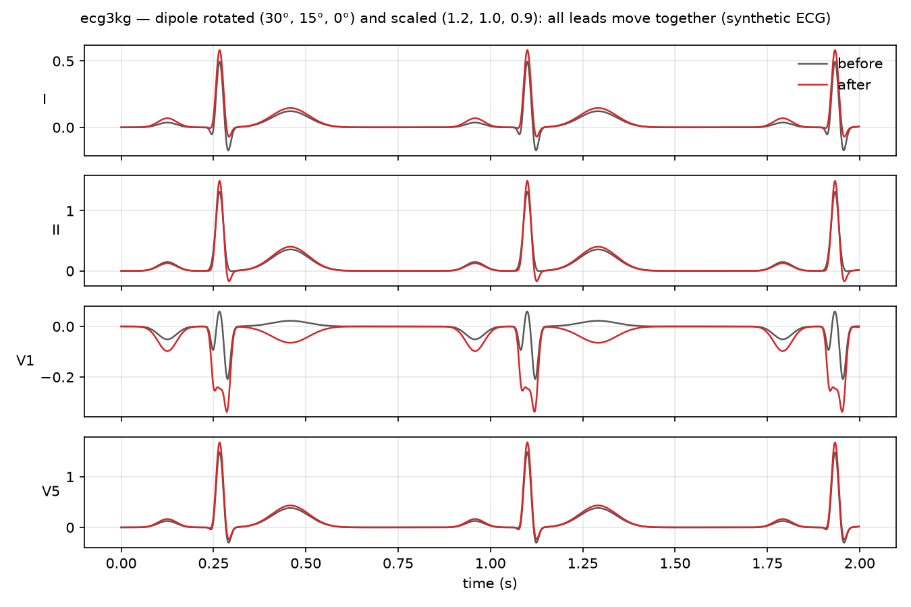

# ecg3kg

[](https://github.com/remicastaing/ecg3kg/actions/workflows/ci.yml) [](LICENSE)

Physiologically-inspired 3D augmentation of 12-lead ECGs, after **3KG** (Gopal et al., ML4H 2021).

The twelve leads of an ECG are twelve *projections* of a single 3D quantity: the electrical dipole of the heart, whose trace over one beat is the **vectorcardiogram** (VCG). Hearts differ in size and orientation inside the chest without any clinical consequence — so a model should learn to ignore that variability. `ecg3kg` makes it explicit: it reconstructs the dipole from the 8 independent leads, **rotates** and **scales** it in 3D, and projects it back onto the leads. All twelve traces move *together*, as the traces of the same heart turned in the chest would — something no per-lead noise, scaling or masking can produce.

```
12-lead ECG ──(inverse Dower)──▶ VCG (x, y, z) ──(rotate R, scale S)──▶ VCG' ──(Dower)──▶ 12-lead ECG'
```



*A synthetic ECG (grey) and the same ECG after rotating the dipole by (30°, 15°, 0°) and scaling it by (1.2, 1.0, 0.9) (red). Lead V1 flips coherently while I, II and V5 barely change: the leads move as projections of one object.*

## Install

```bash
pip install "git+https://github.com/remicastaing/ecg3kg@v0.1.0"          # numpy only
pip install "ecg3kg[torch] @ git+https://github.com/remicastaing/ecg3kg@v0.1.0"  # + torch adapter
```

Python ≥ 3.10; the only hard dependency is `numpy`. (Publication on PyPI is prepared but not yet done — see *Publishing* below.)

## Usage

Everything takes the ECG as an array of shape `(..., n_leads, T)` — any leading dimensions are a batch — plus a **declared lead order**. The package never guesses the order: pass a preset name (`"mimic"`, `"standard"`, `"independent8"`) or an explicit list of lead names.

```python
import numpy as np
import ecg3kg

# A 12-lead ECG projected from a known dipole (any real 12-lead ECG works the same way).
t = np.linspace(0, 2 * np.pi, 500)
vcg = np.stack([np.sin(t), 0.8 * np.cos(t), 0.5 * np.sin(2 * t)])   # (3, T): x, y, z
ecg = ecg3kg.vcg_to_ecg(vcg, leads="standard")                      # (12, T)

# 1) Deterministic transformations
same = ecg3kg.Transform().apply_ecg(ecg, leads="standard")           # zero rotation, unit scale
np.testing.assert_allclose(same, ecg, rtol=1e-6)                     # → identity

t120 = ecg3kg.Transform(angles_deg=(120, 0, 0))                      # 120° about x
thrice = ecg
for _ in range(3):
    thrice = t120.apply_ecg(thrice, leads="standard")
np.testing.assert_allclose(thrice, ecg, rtol=1e-6)                   # 3 × 120° → identity

rs = ecg3kg.Transform(angles_deg=(30, 15, 0), scales=(1.2, 1.0, 0.9))  # rotate then scale
augmented = rs.apply_ecg(ecg, leads="standard")

# 2) Random augmentation, with the sampling law of the paper (r = 45°, s = 1.5)
aug = ecg3kg.RandomVCGAugment(max_rotation_deg=45, max_scale=1.5, p=1.0)
batch = np.stack([ecg] * 8)                                          # (8, 12, T)
out, draws = aug(batch, leads="standard", rng=np.random.default_rng(0), return_params=True)
print(draws[0].transform)   # the exact angles / axes order / scales drawn for element 0
```

With PyTorch (`pip install ecg3kg[torch]`):

```python
import torch, ecg3kg.torch as e3t
x = torch.from_numpy(batch).float()                       # any device
y = e3t.apply_ecg(x, rs, leads="standard")                # same numbers as the numpy call
aug_t = e3t.RandomVCGAugmentTorch(max_rotation_deg=45, max_scale=1.5)
y2 = aug_t(x, leads="standard", rng=0)                    # draws still come from numpy's Generator
```

### Reproducibility

Every random call takes an `rng` — a `numpy.random.Generator` or an integer seed. Nothing global is ever touched, and the order of the draws (apply?, axes permutation, angles, scales, inversions) is fixed and documented, so the same generator state gives the same augmented batch, bit for bit. Pass `return_params=True` to get the exact `Transform` drawn for each element.

### Lead orders

| preset | order |
|---|---|
| `"standard"` | I, II, III, aVR, aVL, aVF, V1–V6 (PTB-XL, wfdb) |
| `"mimic"` | I, II, III, aVR, **aVF, aVL**, V1–V6 (MIMIC-IV-ECG native order) |
| `"independent8"` | I, II, V1–V6 |

If your array has the leads on another axis (e.g. `(T, 12)` from wfdb), pass `leads_axis=-1`. Only the 8 independent leads are used to reconstruct the VCG; III, aVR, aVL and aVF are recomputed exactly on output.

### Two application modes

Reconstructing the VCG is a projection: the ECG has 8 independent leads, the VCG 3 axes, so an ECG passed through the VCG **and back** loses whatever the dipole model does not explain — even with zero rotation. `ecg3kg` offers two ways to apply a transformation `M`:

* **`mode="residual"` (default)**: `x_out = x + D (M − I) D⁻¹ x`. Exact identity when `M = I` (a disabled augmentation is a true no-op); identical to the paper's formula on any purely dipolar signal; keeps the non-dipolar residual of a real ECG untouched. *We rotate the dipole and keep the rest.*
* **`mode="project"`**: `x_out = D M D⁻¹ x` — the formula of Gopal et al. (2021), which projects the ECG onto the dipole model.

Elements a `RandomVCGAugment` decides not to apply (probability `1 − p`) are returned untouched, bit for bit, in both modes.

### Matrices

`ecg3kg.DOWER` (8 × 3, Dower et al. 1980, from Frank's torso model), `ecg3kg.INVERSE_DOWER` (3 × 8, computed as the Moore–Penrose pseudo-inverse of `DOWER`, as in Edenbrandt & Pahlm 1988 — and checked by the test-suite against the published coefficients), and `ecg3kg.KORS` (3 × 8, the regression matrix of Kors et al. 1990, available as `method="kors"`; note it is not an inverse of Dower). Coefficients verified against Jaros, Martinek & Danys 2019 (*Sensors* 19(14):3072, Tables 1–2) and G. D. Clifford's `idowerT.m` (ecgtools, 2006).

## What it does not do

* No temporal augmentation (the 50 % time mask of the paper), no noise, no baseline wander — plenty of libraries do that; compose them with `ecg3kg` in your pipeline.
* No contrastive loss, no per-lead views, no encoder: this is an augmentation library, not a pre-training framework.
* Nothing is downloaded, read or written: the package has no I/O and ships no data.

## Development

```bash
git clone https://github.com/remicastaing/ecg3kg && cd ecg3kg
uv venv && source .venv/bin/activate
uv pip install -e ".[dev,torch]"
pytest -q          # ~80 property tests, < 1 s
ruff check src tests
```

The tests are the specification: identity at zero transform, three 120° rotations compose to the identity, +90° about x sends y onto z, per-axis scaling, non-commutativity of rotation and scale, invariance to the declared lead order, exact derived leads, VCG round-trip, law of the random draws (KS / χ² tests), bit-exact determinism, independent draws within a batch, sensitivity to a single altered matrix coefficient, and torch = numpy.

## Publishing

`.github/workflows/publish.yml` builds and uploads to PyPI on any `v*` tag through [trusted publishing](https://docs.pypi.org/trusted-publishers/). It only works once the project is registered on PyPI with this repository as a trusted publisher; until then the tag simply builds. Nothing forces a PyPI release: installing from the GitHub tag is fully supported.

## Citing

If you use `ecg3kg`, please cite both the method and the package.

```bibtex
@inproceedings{gopal2021_3kg,
  title     = {3KG: Contrastive Learning of 12-Lead Electrocardiograms using Physiologically-Inspired Augmentations},
  author    = {Gopal, Bryan and Han, Ryan and Raghupathi, Gautham and Ng, Andrew and Tison, Geoff and Rajpurkar, Pranav},
  booktitle = {Proceedings of Machine Learning for Health (ML4H)},
  series    = {Proceedings of Machine Learning Research},
  volume    = {158},
  pages     = {156--167},
  year      = {2021},
  url       = {https://proceedings.mlr.press/v158/gopal21a.html}
}
```

and the package via [`CITATION.cff`](CITATION.cff) (GitHub's *Cite this repository* button).

## License

MIT — see [LICENSE](LICENSE). The method is described in the paper above; this is an independent implementation.
